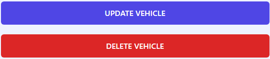

# Maintenance Manatee

## Description

Keeping track of your car’s maintenance can be a headache. So put on cruise control and let the Maintenance Manatee keep track of it for you! Create a profile for your vehicle(s) and add posts describing the work you’ve had done including the cost, date, and any other important details. Join the Maintenance Manatee and spend more time in the fast lane!

We wanted to make a simple, easy to use full stack web app that could take some of the difficulty out of keeping track of maintenance dates and costs. Using Sequelize along with MySQL2 we were able to build a database to keep track of these and render them in a simple and easy to read format.

---

## Table of Contents

- [Installation](#installation)
- [Usage](#usage)
- [Technologies](#technologies)
- [Credits](#credits)

---

## Installation

This app is deployed on Heroku: [Click here](https://maintenance-manatee-20230807-e071f072b462.herokuapp.com/)

If you want to deploy this app locally you'll need to do the following:

- Clone the repository to your local machine
- Navigate to the project repository
- Type `npm install` in the terminal to install dependencies
- Create a file called .env in the root of the directory and enter the following fields:

    `DB_NAME='maintenance_db'`

    `DB_USER='YOUR MySQL USER NAME HERE'`

    `DB_PASSWORD='YOUR MySQL PASSWORD HERE'`

- Type `npm run watch` to start a local server using express and nodemon
- Navigate to `http://localhost:3001/` in your browser to get started

---

## Usage

This app allows users to create a profile for their vehicle(s) then create posts for that vehicle containing any and all maintenance work you've had done.

The user can create an account by clicking the signup button located in the header, or if the user already has made an account they can login by clicking the LOGIN text.

---

Once logged in the user can create a profile for their vehicle by clicking the 'New Vehicle' button. They will then be prompted to enter information including make, model, type of vehicle,year, color, and nickname.

After doing so the vehicle profile will be created and will show a card resembling the above example.

---

The user can then create a post for that specific vehicle by navigating to the Maintenance Log for a given vehicle and clicking the 'Add a Post' button.

---

A vehicle or post can be updated or deleted by clicking the 'Update' button on the vehicles page, or by clicking the post itself in the Maintenance Log.

---

## Technologies

[bcrypt](https://www.npmjs.com/package/bcrypt) - Used to hash users passwords upon account creation.

[Connect Session Sequelize](https://www.npmjs.com/package/connect-session-sequelize) - SQL session store using Sequelize.js.

[dotenv](https://www.npmjs.com/package/dotenv) - An npm module that loads environment variables from a .env file into process.env for added security.

[Express](https://www.npmjs.com/package/express) - Web framework for Node.js.

[Express Handlebars](https://www.npmjs.com/package/express-handlebars) - A Handlebars view engine for Express.

[Express Session](https://www.npmjs.com/package/express-session) - A Node.js module that creates a session middleware using given options.

[Handlebars](https://www.npmjs.com/package/handlebars) - Templating language to render views.

[MySQL2](https://www.npmjs.com/package/mysql2) - MySQL client for Node.js.

[Sequelize](https://www.npmjs.com/package/sequelize) - Promise-based Node.js ORM tool for SQL.

---

## Credits

Zach Gibbs - [Zgibbs58](https://github.com/Zgibbs58)

Christian Gonzales - [cdgonzo23](https://github.com/cdgonzo23)

Chesney Julian - [ChesneyJulian](https://github.com/ChesneyJulian)

Taylor Willis - [t-willis](https://github.com/t-willis)

---